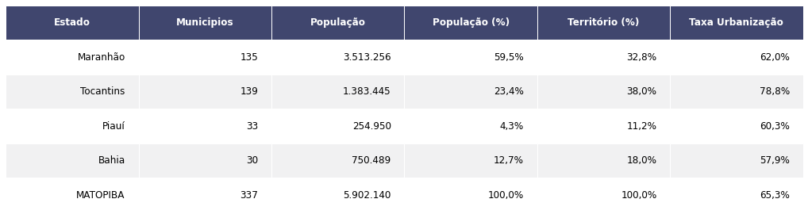

# MATOPIBA

## 1 – INTRODUÇÃO

 O Brasil exemplifica um país onde se há grandes desequilíbrios regionais. E são essas disparidades regionais, em suas mais diversas escalas \(regiões, estados, municípios, micro e mesorregiões\) que tem se tornado objeto de estudo tanto para acadêmicos quanto para gestores públicos. Essa preocupação decorre não apenas do aspecto de justiça social, mas também da eficiência global do sistema econômico. \(Wiltgen, 1991\)

O país é um dos grandes produtores agrícolas do mundo. Estudos chegam a estimar que a produção brasileira alimente 800 milhões de pessoas em todo o mundo \(CONTINI, 2021\). Em contrapartida, a insegurança alimentar faz parte da rotina de mais da metade dos brasileiros, 116,8 milhões de pessoas. A insegurança alimentar grave afeta 9% da população, ou seja, 19,1 milhões de brasileiros estão passando fome. Dos lares em insegurança alimentar grave 31,9% se encontram na região norte e nordeste do país. \(Rede PENSSAN, 2021\).

Inicialmente, a região foi povoada por pequenos agricultores e grandes pecuaristas, mas o padrão de uso da terra mudou rapidamente na última década. A maioria do cultivo recente de terras em MATOPIBA ocorreu através de operações altamente mecanizadas e eficientes – em forte contraste com o histórico de outras fronteiras agrícolas brasileiras. Nos últimos dez anos, MATOPIBA passou a responder por quase 10% da produção de grãos do país, e os seus três produtos principais – soja, milho e algodão – no mínimo dobraram sua produção nesse período. Além disso, as áreas de pastagem em MATOPIBA têm diminuído continuamente desde 1980, em termos absolutos e em participação relativa da área rural.

## 2 – ELEMENTOS DESCRITORES

### 2.1 – Desenvolvimento agrícola no cerrado brasileiro

 Desde a década de 1970, MATOPIBA começou a ser explorada pelo agronegócio através da modernização de técnicas de agricultura. Assim surgia uma nova fronteira agrícola no país localizada nos cerrados de Norte e Nordeste do país, a região logo se filmaria como um ponto estratégico do agronegócio com uma expansão técnico-cientifica-informacional. \(SANTOS, 1994\)

Indubitavelmente os esforços científicos representaram grande parte do sucesso da expansão de MATOPIBA, entretanto não podemos ignorar as relações políticas necessária para a dinâmica agrícola. Guilherme Delgado aponta que:

_\[**...\] agronegócio na acepção brasileira do termo é uma associação do grande**_

_**capital agroindustrial com a grande propriedade fundiária. Essa associação**_

_**realiza uma estratégia econômica de capital financeiro, perseguindo o lucro e**_

_**a renda da terra, sob patrocínio de políticas de Estado. \(DELGADO, 2012, p.94\).**_

_**\(DELGADO, 2012\)**_

A região do Cerrado possui aproximadamente 1,5 milhão de km². Se incluirmos áreas periféricas de divisas com domínios da Amazonia, Mata Atlântica e biomas Caatinga, a área total pode ultrapassar 1,8 milhão de km². A primeira expansão agrícola na região foi no estado do Mato Grosso, até então considerado como uma fronteira agrícola. Com a modernização das safras e com fatores como o baixo custo de terras; áreas planas e extensas; solos potencialmente produtivos; disponibilidade de água e clima propício, com dias longos e elevada intensidade de radiação solar, estado como Maranhão, Tocantins, Piauí e Bahia também começaram a atrair produtores e investidores rurais. \(Horvat et al., 2015\)

Do acrônimo formado com as siglas desses estados originou-se MATOPIBA. A região programa compreendendo uma extensa área dos estados de Maranhão, Tocantins, Piauí e Bahia, superando em tamanho países como Alemanha, Uruguai e Itália.

A agricultura moderna, caracteriza-se pelo intensivo uso de tecnologia e recursos naturais, bem como o baixo uso de mão de obra, estando ligada à políticas nacionais-desenvolvimentistas implantadas desde o século XX. Porém, foi durante os governos da ditadura militar \(1964-1985\), que MATOPIBA experienciou o inicio da sua mais acentuada exploração agrícola através da combinação de mais obras infra estruturais e políticas de credito agrícola \(BRAGA, 1998\)

### 2.2 – Delimitação Territorial

A delimitação geográfica do MATOPIBA aconteceu através de um acordo entre o Ministério do Desenvolvimento agrário \(MDI\), Instituto Nacional de Colonização e Reforma Agrária \(INCRA\) e do Grupo de Inteligência Territorial Estratégica \(GITE\) juntamente com a Empresa Brasileira de Pesquisa Agropecuária \(EMBRAPA\) \(MIRANDA; MAGALHÃES; CARVALHO, 2014\).

Por meio do Decreto Nº 8447, de 6 de maio de 2015 expressa a finalidade de promover e coordenar políticas públicas direcionadas ao desenvolvimento econômico sustentável fundado nas atividades agrícolas e pecuárias que provenham na melhoria da qualidade de vida da população \(XAVIER, 2019\). Mondardo e Azevedo \(2019, p.305\) exploram as diretrizes do decreto Nº 8447, de 6 de maio de 2015:

**I - Desenvolvimento e aumento da eficiência da infraestrutura logística relativa às atividades agrícolas e pecuárias;**

**II - Apoio à inovação e ao desenvolvimento tecnológico voltados às atividades agrícolas e pecuárias; e**

**III - Ampliação e fortalecimento da classe média no setor rural, por meio da implementação de instrumentos de mobilidade social que promovam a melhoria da renda, do emprego e da qualificação profissional de produtores rurais.**

A região do MATOPIBA é composta por 336 municípios de quatro estados fronteiriços, sendo 143 do Maranhão, 130 do Tocantins, 33 do Piauí e trinta da Bahia. É uma região coberta em sua maior pare pelo cerrado e com ala produtividade.

Diversas técnicas numéricas e cartográficas foram usadas como aporte para decisões estratégicas para delimitação da área de MATOPIBA. O primeiro critério para delimitação geográfica do espaço foi as áreas existentes de cerrado nos Estados do Maranhão, Piauí, Tocantins e Bahia. Sendo qualificada a partir de imagens de satélite e a dinâmica de uso e ocupação dessas terras. O segundo critério foi a dimensão socioeconômica, principalmente no relativo à produção agropecuária e florestal das pesquisas anuais do IBGE, seguido por critérios como quadro agrícola e agrário. \(GITE/EMBRAPA 2014\)

Em 2013, foi realizada a delimitação oficial do território de MATOPIBA pelo GITE, reservando a região programa 73 milhões de hectares, o que representa 8,6% do território brasileiro. Segundo o GITE, a delimitação geográfica da região representa um melhor monitoramento e avaliação de políticas públicas e privadas na região. \(MAGALHÃES e MIRANDA, 2014\)

Figura 1 – Delimitação territorial MATOPIBA

### 2.3 – População

A população de MATOPIBA é estimada em 5,9 milhões de pessoas o que representa 3,1% da população nacional.

Sua densidade demográfica é de 13,4 habitantes por km² e sua população rural é de 2 milhões de pessoas resultando em uma taxa de urbanização de 65%. Essa taxa de urbanização em MATOPIBA está ligada não somente a migração rural mas também ao fluxo migratório de outras regiões brasileiras.

### 2.4 - Principais municipios exportadores

### 

### 2.5 -

### 2.6 - Transporte

A partir do período Vargas \(1930-1945\), a “Marcha para o Oeste” estabeleceu projetos de colonização agrícola em Goiás e Mato Grosso. \(BRAGA, 1998\)

Na década de 1950, em especial durante a gestão JK \(1956-1961\), foram construídos grandes trechos de rodovias na região – por exemplo a rodovia Belem-Brasilia e a BR 364 -, além disso foi construído em pleno coração do cerrado o prédio de Brasília. Esse investimento público fortaleceu a estrutura e a conexão da região com o Sul e Sudeste, favorecendo ainda a migração principalmente para nova capital.

## 3 – ECONOMIA

Nos últimos 20 anos, segundo **Sá et al. \(2015\)**, observou-se grande aumento na produção de soja resultante do crescimento da área plantada e da produtividade. A consequência direta desse processo foi o aumento do PIB dos municípios que constituem a região. No entanto, segundo essas autoras, há concentração da riqueza gerada no MATOPIBA, uma vez que grande parcela da população das cidades localizadas nessa região está à margem dos benefícios gerados pelo agronegócio.

 A Embrapa identificou que das 250 mil fazendas localizadas no MATOPIBA registradas no Censo Agropecuário de 2006 do IBGE, 94% dessas unidades têm como proprietários pessoas pobres \(14%\) ou muito pobres \(80%\), conforme mostra a tabela abaixo: 

### Renda população

A Embrapa identificou que das 250 mil fazendas localizadas no MATOPIBA registradas no Censo Agropucuário de 

Distribuição da renda bruta \(rb\) em classes de salário mínimo mensal \(slmm\), frequência, em número de estabelecimentos e respectivas porcentagens, participação de cada classe na renda bruta \(%\) e renda bruta mensal por estabelecimento \(rb/est./slmm\)

## 4 – MEIO AMBIENTE

O cerrado é o segundo maior bioma brasileiro e concentra um terço da biodiversidade nacional e 5% da flora e fauna mundial. A flora do cerrado é considerada a mais rica savana do mundo, e estima-se que entre 4 a 7.000 espécies habitam essa região.

Enquanto o desmatamento na Amazônia tem recebido atenção nacional e internacional, o que ocorre no Cerrado não tem a mesma visibilidade, apesar de ser superior em termos absolutos. Talvez porque ainda prevalece o preconceito de que se trata de um ambiente de menor valor, ideia às vezes reforçada pelos livros didáticos \(**OLIVEIRA, 2014** \), ou, assumindo a hipótese de **Oliveira e Hecht \(2016\)** que é um território a ser sacrificado.

O estudo 'TerraClass Cerrado', realizado em conjunto pelo INPE, Empresa Brasileira de Pesquisa Agropecuária - Embrapa, e outras instituições, destaca a relação direta entre a pecuária, a agricultura e o desmatamento. Ao analisar o uso dado ao tamanho total das áreas desmatadas até 2013 \(cerca de 885.000 km2\), esta pesquisa revela que 94,7% dessas áreas foram utilizadas para pastagem plantada ou agricultura anual / perene \(**BRASIL, 2015**\) A expansão da agricultura, base do agronegócio brasileiro, é considerada fundamental para o crescimento da economia nacional. Nesse aspecto, o Cerrado tem sido importante. De acordo com**Reis et al. \(2017\)** , o bioma representa cerca de 60% da produção agrícola do país, liderando a produção de soja, milho, algodão e até cana-de-açúcar.

Embora a pecuária e a agricultura sejam responsáveis ​​pela matriz do desmatamento no Cerrado, invariavelmente tratado pelo agronegócio como fronteira, é importante notar que isso aconteceu de forma relativamente rápida. O argumento aqui defendido é que a expansão de ambas as atividades econômicas não ocorreu de forma aleatória, sendo resultado exclusivo da escolha de cada proprietário rural sobre onde, quando e o que cultivar. Por trás dessas preferências estava o apoio a políticas oficiais, guiadas pelo modelo de agricultura intensiva em capital, tecnologia e uso de recursos naturais. Principalmente a partir da década de 1970, a construção de infraestrutura e políticas fiscais, de crédito, de inovação tecnológica, de assistência técnica, de colonização, etc., induziram ao estabelecimento de empreendimentos agrícolas em determinadas regiões do bioma, tratada como uma fronteira a ser conquistada. Em contínua ocupação ao longo dos anos, algumas áreas consolidaram-se, originando até mesmo novos municípios.

### MATOPIBA E O DESMATAMENTO NO CERRADO 

 Em 2010, MATOPIBA também foi responsável por 65% do desmatamento do Cerrado. No entanto, não está claro se a produção de grãos expandiu-se sobre áreas já desmatadas \(de pastagem\) ou se áreas de vegetação nativa foram reprimidas para o cultivo. Parte da contribuição do **INPUT** em MATOPIBA é preencher esta lacuna de informação. Ao contrário da Amazônia, o desmatamento em MATOPIBA não é necessariamente ilegal; os requisitos legais do Cerrado é que são relativamente menos rigorosos. Deste modo, portanto, soluções para manter o equilíbrio entre produção e proteção podem exigir políticas diferentes, cuja aplicação e eficácia ainda precisam ser comprovadas. \(INPUT, 2021\)

\*\*\*\*

## **7 - Referências Bibliográficas**

SANTOS, Milton. **Técnica, espaço, tempo**: globalização e meio técnico-científico-informacional. São Paulo: \[s.i\], 1994.

DELGADO, Guilherme. **Do capital financeiro na agricultura à economia do agronegócio**_:_

mudanças cíclicas em meio século \(1965-2012\). Porto Alegre: UFRGS, 2012.

Horvat, R., Watanabe, M., & Yamaguchi, C. K. \(2015\). Fertilizer consumption in the region MATOPIBA and their reflections on Brazilian soybean production. International Journal of Agriculture and Forestry, 5\(1\), 52-59.

IBGE. \(2021\). Retrieved 10 September 2021, from [https://www.ibge.gov.br/busca.html?searchword=matopiba](https://www.ibge.gov.br/busca.html?searchword=matopiba)

Glauber Lopes Xavier, MATOPIBA: a ocupação da nova fronteira agrícola nos quadros do padrão exportador de especialização produtiva, Confins, 2019

XAVIER, Glauber Lopes. MATOPIBA: a ocupação da nova fronteira agrícola nos quadros do

padrão exportador de especialização produtiva. Confins. Revue franco-brésilienne de

géographie/Revista franco-brasilera de geografia, n. 39, 2019.

MONDARDO, Marcos Leandro; DE AZEVEDO, José Roberto Nunes. MATOPIBA: DO

DOMÍNIO DA TERRA E ABUSO DA ÁGUA AOS TERRITÓRIOS DE RESISTÊNCIAS

DAS POPULAÇÕES TRADICIONAIS/MATOPIBA: from the domain of land and water

abuse to the territories of resistance of the traditional populations/MATOPIBA: del dominio de la tierra y abuso del agua a los territorios de resistencias de las poblaciones

tradicionales. REVISTA NERA, n. 47, p. 296-320, 2019.

MIRANDA, E.; MAGALHÃES, Lucíola Alves; CARVALHO, Carlos Alberto. Proposta de

Delimitação Territorial do MATOPIBA. Embrapa Territorial-Outras publicações técnicas

\(INFOTECA-E\), 2014.

Cerrado’, old and new agricultural frontiers Mauro Oliveira Pires Brazilian Political Science Reviewvol. 14 issue 3 \(2020\) Published by Associação Brasileira de Ciência Política

Economic growth patterns of the MATOPIBA’S municipalities-; Santana et al - Sociedade Brasileira de Economia e Sociologia Rural

### \*\*\*\*

